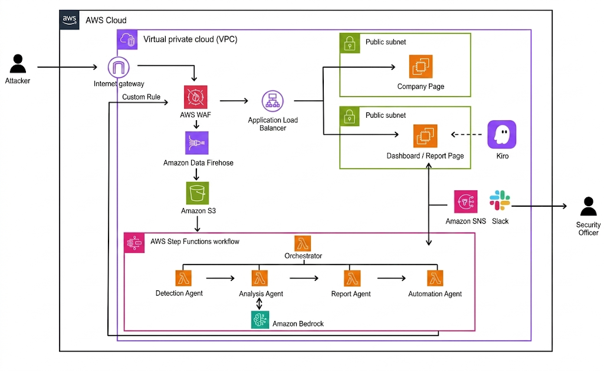
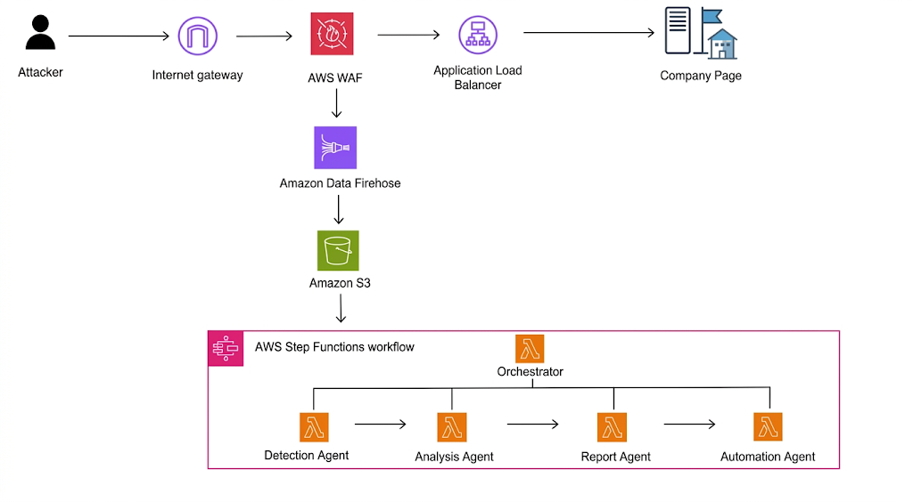
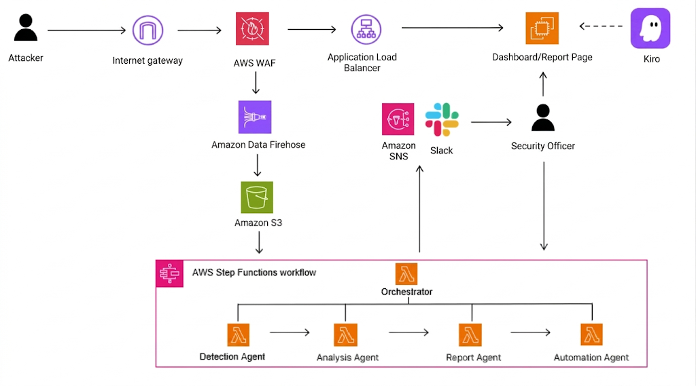
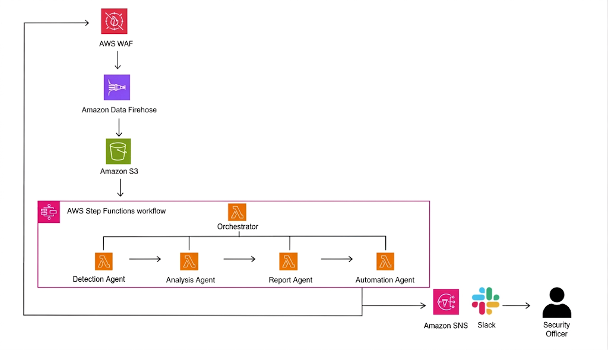

# Building a Production-Ready Autonomous SOC for AWS WAF
## How I Won an AI Agent Hackathon

This hackathon's theme was **AI Agent development**, and I decided to tackle a problem I face every day. I built an AI-powered **AWS WAF security automation system** designed to eliminate the tedious manual processes between threat detection and rule enforcement.

> *"As a Security Architect, I always felt friction when collaborating with SOC teams. I wanted to focus purely on distinguishing true positives from false positives, but the collaboration process kept dragging on, and I often found myself analyzing unnecessary traffic."*

To solve this, I designed a streamlined workflow utilizing four specialized AI Agents:

*   **Detection Agent:** Identifies anomalous traffic through pattern-based analysis.
*   **Analysis Agent:** Integrates Claude via **AWS Bedrock** for deeper, highly accurate threat analysis.
*   **Report Agent:** Uses a context-aware mathematical algorithm to score the traffic's safety impact *before* any rule is applied.
*   **Automation Agent:** Once a security admin approves a recommended rule from the dashboard, this agent automatically creates the **AWS WAF Custom Rule**, feeding directly back into WAF to complete the loop.

Alerts are delivered directly to security teams via **Amazon SNS** and **Slack**. Furthermore, the dedicated dashboard built with Kiro supports PDF export, fully replacing the outdated email reporting process and making the system production-ready from day one.

---

## The Core Challenge: Quantifying Operational Efficiency

While building the core multi-agent workflow was a technical hurdle, the biggest challenge was **quantifying and implementing the WAF operational cost/labor reduction logic**. 

Translating automated security actions into measurable, real-world human-hour metrics proved to be incredibly difficult. We had to design a telemetry system that could dynamically assess how much manual intervention—such as log querying, pattern matching, writing regex, and testing custom rules—was actually bypassed by the agents for each type of incident. 

Overcoming this implementation hurdle allowed us to prove the real business value of our system, rather than just showing off an impressive AI concept.

---

## Measurable Impact: Performance Metrics

By deploying this multi-agent architecture, we achieved massive improvements across threat mitigation speed, financial efficiency, and overall security posture.

### 1. Threat Mitigation & Response Speed
| Metric | Performance |
| :--- | :--- |
| **Blocked Attacks (Current Month)** | 1,247 cases |
| **Automated Response Success Rate** | **94.3%** |
| **Average Response Time** | **58 seconds** (vs. 4.2 hours with manual response) |

### 2. Cost & Labor Savings
*   **Downtime Prevented:** 3.2 hours per month.
*   **Server Downtime Cost Reduction:** Approximately **$1,280 saved** per month.
*   **WAF Operational Labor Reduction:** **12 hours saved** per month, freeing up security engineers for higher-priority tasks.

### 3. Security Posture Improvement
The system dramatically lowered our overall infrastructure risk profile by immediately clamping down on active vectors.
*   **Risk Score Before Rule Application:** 100 points
*   **Risk Score After Rule Application:** 24.8 points
*   **Overall Risk Reduction:** **75.2% decrease** in vulnerability exposure.

---

## Detailed Architecture & Process

### 1. Log Collection & Data Pipeline
The first step is gathering and processing the data efficiently to feed into our agents.

*   **Real-time Collection:** Web access logs generated by AWS WAF are streamed in real-time via **Amazon Data Firehose**.
*   **Batch Processing:** Logs are aggregated and stored in an **Amazon S3** bucket every minute. *(Note: The default interval is 5 minutes, but this can be adjusted via Firehose).*
*   **Trigger Mechanism:** As soon as a log file is created in S3, an **AWS Step Functions** workflow is automatically triggered to start the analysis process.

### 2. Notification & Admin Approval
Human oversight is crucial, but it shouldn't be a bottleneck. We made the approval process as seamless as possible.

Immediate alerts are sent to the security admin via **Amazon SNS** or **Slack**. The admin can then log into the dedicated dashboard to review the specific details of the AI-proposed rule. 

After reviewing key metrics such as the **Target IP** (e.g., `177.138.213.217`), **Country** (e.g., `KR`), and **Estimated Cost**, the admin makes a final decision by simply clicking the **[Approve]** or **[Reject]** button.

### 3. Automated Response & Feedback Loop
Once the decision is made, the system handles the rest.

If the admin clicks **[Approve]**, the **Automation Agent** is instantly activated. It automatically applies the new Custom Rule directly to the AWS WAF. 

To close the loop, a final confirmation message is sent back to the security admin via SNS or Slack, ensuring the team is always aware that the threat has been successfully mitigated.

---

## Why It Won: High Practical Utility

During the final presentation, the judges showed immense interest in the core idea because of its **high practical utility and real-world applicability**. 

Many AI hackathon projects remain abstract wrappers, but this system addresses a tangible, multi-hour production pain point for enterprise security teams and resolves it in under a minute. The ability to present clear operational cost metrics alongside a robust, closed-loop automation architecture is what ultimately secured our hackathon victory.